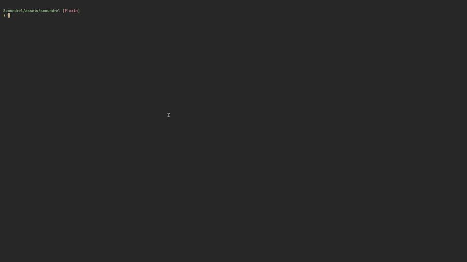

# Scoundrel TUI

A polished terminal version of Scoundrel, built with Textual, Rich, Pillow, and
textual-image.

## Demo



## Requirements

- Python 3.14 or newer
- `uv`

## Setup

Install the project dependencies:

```bash
uv sync
```

Run the game with either command:

```bash
uv run scoundrel
# or
uv run scoundrel-tui
```

## Controls

- `1` to `4`: take a card slot
- `Left` / `Right`: move selection
- `Enter`: take the selected card
  - `W`: explicitly fight a monster with the equipped weapon
  - `B`: explicitly fight a monster barehanded
- `A`: avoid the room when allowed
- `P`: toggle portrait and pixel art
- `N`: start a new game
- `Q`: quit

## Rules

- Video explanation: [How to Play Scoundrel | The Best 1-Player Card Game of All Time by Rulies](https://www.youtube.com/watch?v=Gt2tYzM93h4)
- BoardGameGeek: https://boardgamegeek.com/boardgame/191095/scoundrel

## Image Mode

By default, the app uses Kitty/TGP-style terminal images. You can change the
renderer with `SCOUNDREL_IMAGE_MODE`:

```bash
SCOUNDREL_IMAGE_MODE=halfcell uv run scoundrel
```

## Assets

All visual assets are from [The Battle for Wesnoth](https://www.wesnoth.org/),
one of the best games ever made.
